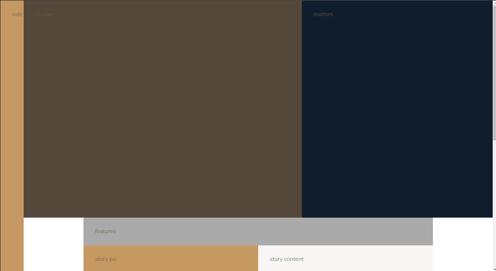

# Nexter

This project is the final project from [Jonas Schmedtmann's Advanced CSS and Sass](https://www.udemy.com/share/101Wkw3@XUXADGJ2SBk01w31q7FOguKX5O6UB5DNF__XsHkWxPt55ylBddr_bGSUai0fPpmK/) course, focusing on creating a responsive landing page using the CSS Grid layout method.

In addition to mastering grid layouts, the course covers SVG icons, the BEM methodology, responsive design principles, and various CSS tricks and tools. These elements help create visually appealing, well-structured, and highly maintainable websites.

View the live project at []().

## Grid Layout

CSS Grid is a powerful tool for quickly creating complex and responsive layouts. Providing a two-dimensional grid system offers unparalleled control over the positioning and sizing of elements. Compared to traditional layout methods, CSS Grid simplifies the process, making it a valuable asset for modern web development. Its ability to handle simple and intricate designs, flexibility, and efficiency solidifies its position as a cornerstone of web layout design.

```scss
.container {
	grid-template-columns:
		[sidebar-start] 8rem [sidebar-end full-start] minmax(6rem, 1fr)
		[center-start]
		repeat(8, [col-start] minmax(min-content, 15rem) [col-end])
		[center-end]
		minmax(6rem, 1fr) [full-end];
	grid-template-rows: auto auto minmax(min-content, 40vw) repeat(3, auto);
}
```



> [!TIP]
> It's a good practice to name your grid lines columns/rows.
> Remember that you can't use -1 in implicit columns/rows.


## Responsive Design

This project employs a Desktop First approach to responsive design, prioritizing the desktop experience and then adapting the layout for smaller screens using media queries. Unlike rigid breakpoint-based systems like Bootstrap, we adopt a more fluid approach, adding media queries only when the design becomes compromised at specific screen sizes. While suitable for smaller projects, this method might be less practical for complex layouts.

CSS Grid offers a powerful alternative to traditional layout methods. Its two-dimensional structure allows for precise control over row and column placement, eliminating the need for unnecessary container elements. By utilizing `grid-template-columns` with `repeat(auto-fit, min-max ())`, you can create flexible and responsive layouts that automatically adjust to different screen sizes. For instance, the features section effectively adapts to various devices without relying on media queries.

```scss
.homes {
	display: grid;
	grid-template-columns: repeat(auto-fit, minmax(25rem, 1fr));
	gap: var(--gap-xl);
}
```


This Sass snippet provides a robust and flexible media query management system. By defining breakpoints as a map within the `$breakpoints` variable, you establish a centralized location for managing screen sizes. The `respond-to` mixin encapsulates the logic for creating media queries based on these breakpoints, offering control over both `max-width` and `min-width` scenarios. This approach promotes code reusability, maintainability, and consistency across your project. Including error handling for invalid breakpoints and directions enhances the reliability of the mixin.
```scss
/* Media Qurey Manager */
@mixin respond-to($breakpoint, $direction: max) {
	$breakpoint-value: map-get(
		$map: $breakpoints,
		$key: $breakpoint,
	);

	@if $breakpoint-value {
		@if $direction == "max" {
			@media only screen and (max-width: $breakpoint-value) {
				@content;
			}
		} @else if $direction == "min" {
			@media only screen and (min-width: $breakpoint-value) {
				@content;
			}
		} @else {
			@warn "Invalid direction '#{$direction}' for the breakpoint #{$breakpoint}";
		}
	} @else {
		@warn "No value found for breakpoint #{$breakpoint}";
	}
}
```
| Desktop Screens                             | Tablet & Mobile Screens                     |
|:-------------------------------------------:|:-------------------------------------------:|
|            |             |


## SVG Icons

This project uses SVGs from [flaticon](https://www.flaticon.com/). SVG sprite is created by [SVG sprite generator](https://www.npmjs.com/package/svg-sprite-generator) then readily displayed with the help of `<use>` element:
```scss
<svg class="feature__icon">
  <use xlink:href="sprite.svg#world"></use>
</svg>
```


## NPM and NPM Scripts

This project leverages npm (Node Package Manager) for dependency management and build processes. Besides the start script that runs live-server and compiles SCSS in parallel, we also have a `build:css` script that performs the following actions:   

- Compiles SASS (SCSS)
- Uses PostCSS Autoprefixer for better browser support
- Compresses (minifies) CSS

  And `svgme` script that performs the following actions:

  - compress all the SVG in the specified directory.
  - creating an SVG sprite.

 
  ## SupaCool Tools

  Here is a list of some cool tools used throughout the projects:

- [flaticon](https://www.flaticon.com/): Used for getting SVG icons.
- [Cubic Bezier](https://cubic-bezier.com/#.2,0,.4,1): A tool used to easily generate desired transition values for the cubic-bezier() function.
- [HTML Glyphs](https://css-tricks.com/snippets/html/glyphs/): A list of glyphs and their corresponding codes that can be used in HTML and CSS files.
- [BEM Methodology](https://getbem.com/ ): This CSS methodology helps us organize our code more easily and prevents headaches caused by thinking about how to name a CSS class.
- [Can I Use](https://caniuse.com/ ): This tool provides us with up-to-date browser support tables for front-end web technologies on desktop and mobile web browsers.
- [Screen to Gif](https://www.screentogif.com/): ScreenToGif allows you to record a selected screen area, edit it, and save it as a gif or video.
- [Squoosh](https://squoosh.app/): This image compression web app allows you to explore the advanced options provided by various image compressors.
- [Real FavIcon Generator](https://realfavicongenerator.net/): Online favicon generator for multible platforms.

## Additional Challenges

- [x] Create a functional and responsive website navigation.
- [x] Make the page 100% responsive (< 400px).
- [ ] Optimize images.
- [ ] Redesign gallery section for devices with smaller screens.
- [x] Optimize for Full HD screens and higher.
